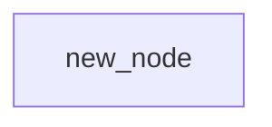

# 概念つぶし TODOリスト（完全版）

- 1項目 = 1文で説明できる
- 最小コードを書く
- わざと壊す
- 壊れ方を説明できる
- 今の仕事と結びつける

## 時間・並行・非同期（最優先）

- [ ]  同期 / 非同期
- [ ]  ブロッキング / ノンブロッキング
- [ ]  並行 / 並列
- [ ]  スレッド
- [ ]  プロセス
- [ ]  イベントループ
- [ ]  コールバック
- [ ]  Promise / Future
- [ ]  async / await
- [ ]  デッドロック
- [ ]  レースコンディション
- [ ]  排他制御（ロック）
- [ ]  アトミック操作
- [ ]  スレッドセーフ

---

## データ・状態

- [ ]  状態（state）
- [ ]  副作用
- [ ]  ミュータブル / イミュータブル
- [ ]  参照渡し / 値渡し
- [ ]  シャローコピー / ディープコピー
- [ ]  ライフタイム
- [ ]  スコープ
- [ ]  グローバル状態

---

## 関数・オブジェクト・実行モデル

- [ ]  関数
- [ ]  クラス
- [ ]  インスタンス
- [ ]  コンストラクタ
- [ ]  継承
- [ ]  委譲
- [ ]  ポリモーフィズム
- [ ]  カプセル化
- [ ]  高階関数
- [ ]  クロージャ
- [ ]  コールスタック

---

## 設計・構造

- [ ]  抽象化
- [ ]  責務
- [ ]  関心の分離
- [ ]  レイヤードアーキテクチャ
- [ ]  クリーンアーキテクチャ
- [ ]  疎結合 / 密結合
- [ ]  インターフェース
- [ ]  境界（boundary）
- [ ]  依存関係

---

## エラー・信頼性

- [ ]  例外
- [ ]  エラーハンドリング
- [ ]  リトライ
- [ ]  フォールバック
- [ ]  冪等性
- [ ]  トランザクション
- [ ]  ロールバック
- [ ]  タイムアウト

---

## フレームワーク・魔法ゾーン

- [ ]  DI（依存性注入）
- [ ]  IoC
- [ ]  コンテナ
- [ ]  ランタイム
- [ ]  フック
- [ ]  ミドルウェア
- [ ]  ライフサイクルフック
- [ ]  アノテーション / デコレータ

---

## Web・API

- [ ]  REST
- [ ]  ステートレス
- [ ]  セッション
- [ ]  クッキー
- [ ]  トークン
- [ ]  認証
- [ ]  認可
- [ ]  HTTPステータスコード
- [ ]  CORS

---

## パフォーマンス・運用

- [ ]  ボトルネック
- [ ]  スケーラビリティ
- [ ]  レイテンシ
- [ ]  スループット
- [ ]  キャッシュ
- [ ]  メモリリーク
- [ ]  GC
- [ ]  オーバーヘッド

---

## AI時代・責任まわり

- [ ]  ブラックボックス
- [ ]  ハルシネーション
- [ ]  再現性
- [ ]  決定性 / 非決定性
- [ ]  コンテキスト
- [ ]  責任の所在

